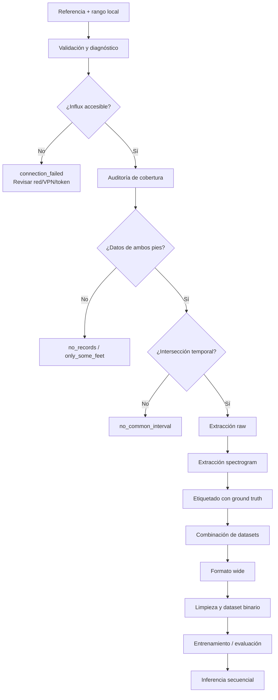
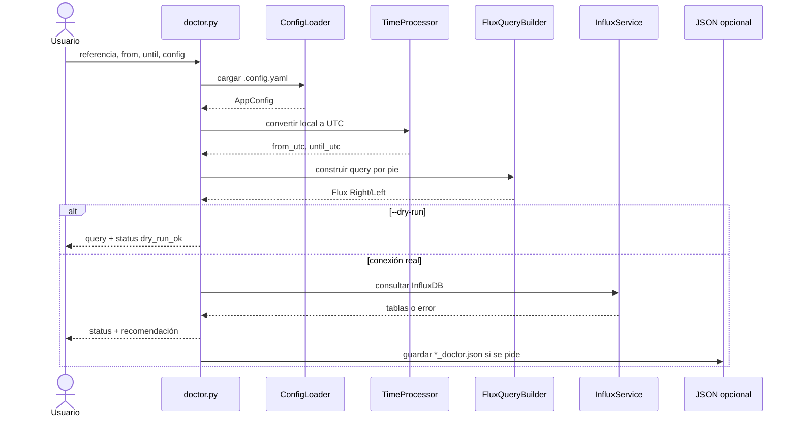
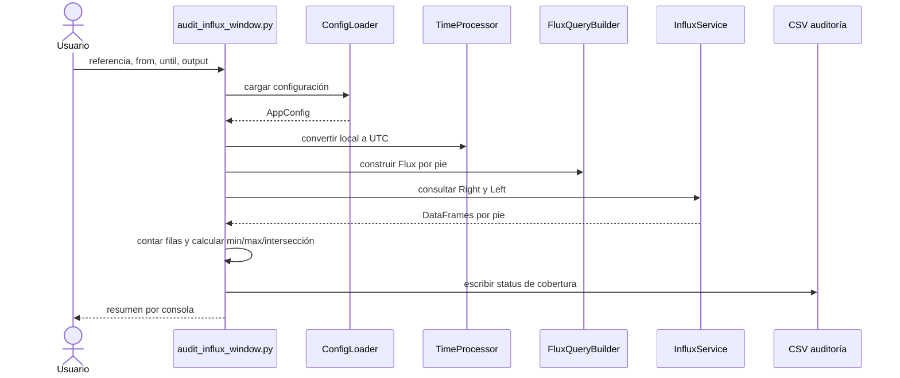
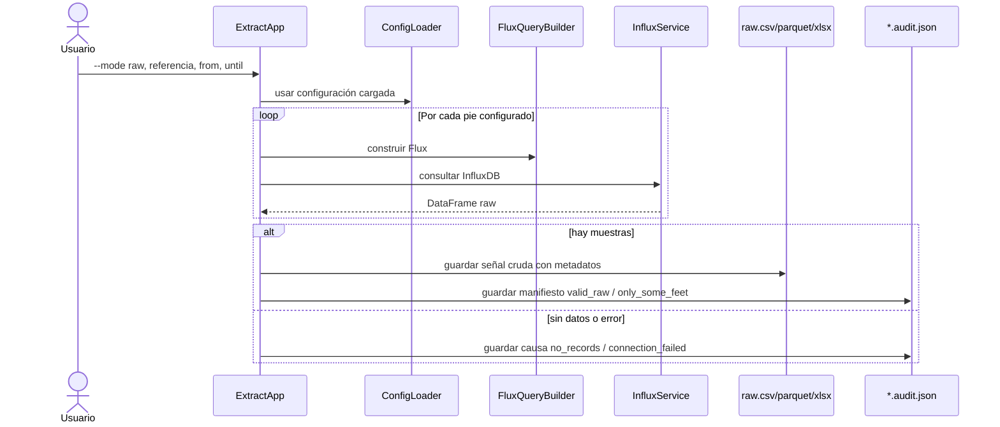
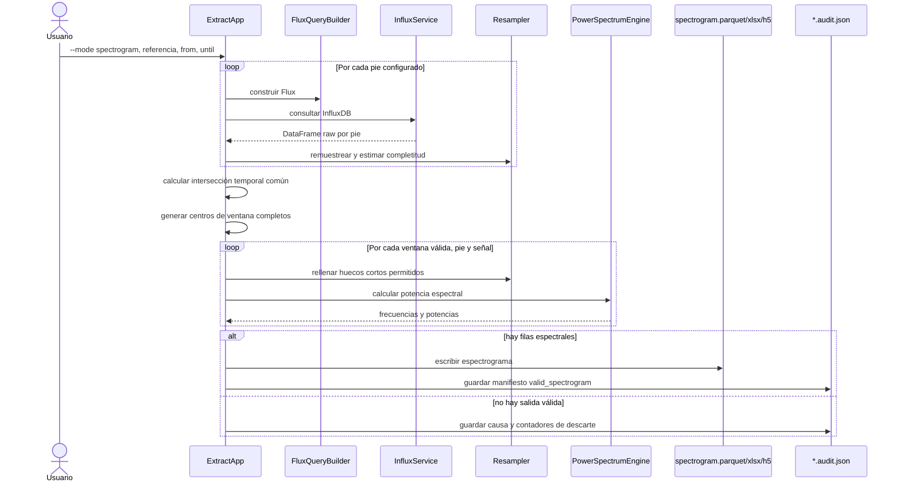
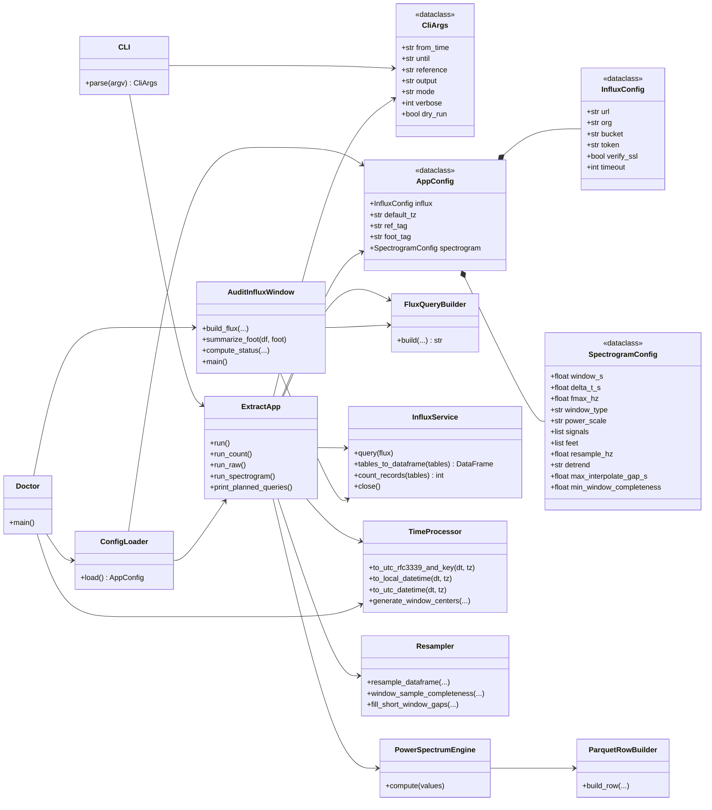
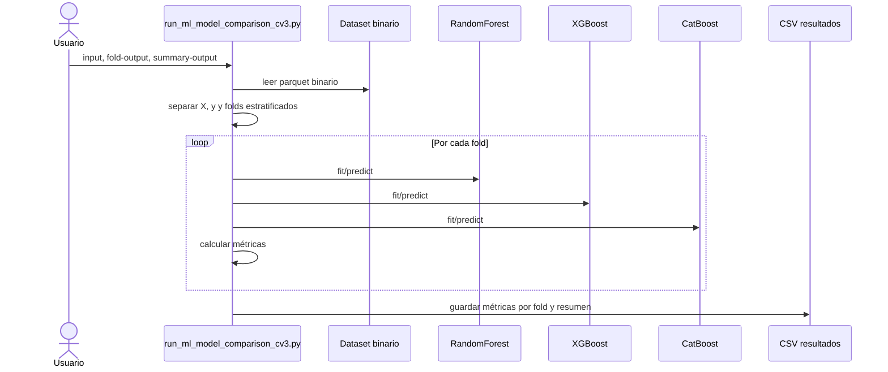
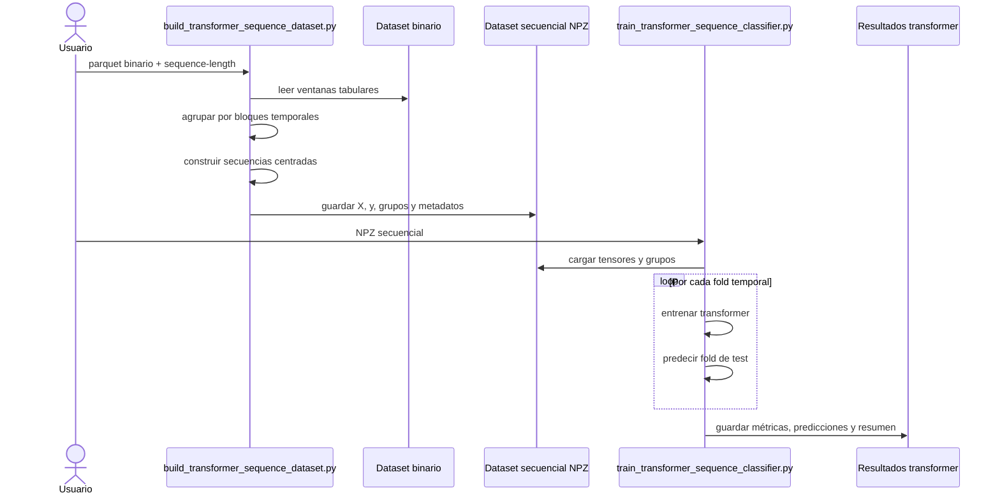
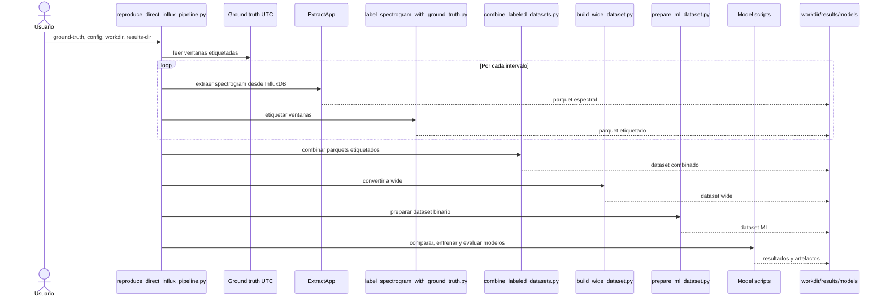

# 2025_OCH_Gait

Repositorio para extraer señales IMU de marcha desde InfluxDB, transformarlas en ventanas espectrales, etiquetarlas con ground truth temporal y preparar datasets para modelos de clasificación de marcha/no marcha.

El objetivo del repositorio es cubrir el flujo técnico completo desde la comprobación de una ventana temporal hasta la generación de artefactos listos para entrenamiento, evaluación o inferencia.

## Qué permite hacer

El proyecto cubre estos casos de uso:

* comprobar conexión, zona horaria, referencia y cobertura de datos en InfluxDB
* auditar una ventana temporal antes de extraer datos
* extraer señal cruda por pie
* generar espectrogramas por ventana temporal
* etiquetar ventanas espectrales con ground truth
* preparar ampliaciones balanceadas del ground truth para reentrenamiento
* combinar varios datasets etiquetados
* transformar datos de formato largo a formato ancho para ML
* limpiar y preparar un dataset binario `walking` / `not_walking`
* entrenar y evaluar modelos clásicos
* ejecutar inferencia sobre una secuencia temporal raw

La lógica principal está en el paquete `gait_analysis/`.

## Entorno

El proyecto usa Poetry para gestionar dependencias.

```bash
poetry install
```

Los ejemplos usan:

```bash
poetry run python ...
```

## Configuración

Debe existir un fichero `.config.yaml` en la raíz del proyecto. Ahí se definen:

* conexión a InfluxDB
* bucket, organización y token
* tags usados para filtrar referencia y pie
* zona horaria local
* señales IMU a procesar
* pies disponibles
* parámetros del espectrograma

La configuración actual procesa:

* acelerómetro: `Ax`, `Ay`, `Az`
* giroscopio: `Gx`, `Gy`, `Gz`
* pies: `Right`, `Left`

Las fechas introducidas por CLI se interpretan en la zona horaria configurada y se convierten a UTC antes de consultar InfluxDB.

## Flujo general



## Etapas del pipeline

| Etapa | Qué hace | Entrada | Salida |
| --- | --- | --- | --- |
| Diagnóstico | Valida configuración, fechas, zona horaria, query Flux y conexión. | referencia, `from`, `until`, `.config.yaml` | salida por consola y opcional `*_doctor.json` |
| Auditoría de cobertura | Cuenta registros por pie y calcula rangos temporales reales. | referencia, rango temporal, config | CSV con estado de cobertura |
| Extracción raw | Descarga muestras crudas de InfluxDB por pie. | referencia, rango temporal, config | `.parquet`, `.csv` o `.xlsx` + `*.audit.json` |
| Extracción spectrogram | Remuestrea, alinea ambos pies, crea ventanas completas y calcula potencia espectral. | datos InfluxDB y config espectral | espectrograma en `.parquet`, `.xlsx` o `.h5` + `*.audit.json` |
| Ground truth | Importa, limpia o genera tablas de etiquetas temporales. | Excel/CSV de etiquetas o plantilla | ground truth normalizado |
| Ampliación balanceada | Selecciona ventanas etiquetadas con balance por duración y diversidad de referencias. | ground truth UTC y candidatos con cobertura | ground truth balanceado + cola de etiquetado |
| Etiquetado | Cruza cada ventana espectral con el ground truth. | espectrograma + ground truth | parquet etiquetado |
| Combinación | Junta varios bloques etiquetados. | parquets etiquetados | parquet combinado |
| Wide | Convierte de formato largo a una fila por `time_center`. | parquet combinado | parquet wide |
| Limpieza | Elimina o controla filas con valores faltantes. | parquet wide | parquet wide limpio |
| Dataset ML | Construye atributos y objetivo binario. | parquet wide limpio | dataset binario |
| Modelado | Entrena y evalúa clasificadores. | dataset binario | modelos, predicciones y resúmenes |
| Inferencia | Aplica un modelo sobre una secuencia temporal. | referencia/rango o espectrograma previo | CSV con probabilidad y predicción por ventana |

## Diagnóstico rápido

Antes de extraer datos, se recomienda ejecutar `doctor`.

```bash
poetry run python gait_analysis/doctor.py \
  -f "2026-05-05 10:25:00" \
  -u "2026-05-06 13:53:00" \
  -q "AGCHUG064-10" \
  --print-query \
  --json-output "salidas_test/AGCHUG064-10_doctor.json"
```

Para revisar solo la conversión horaria y la query, sin conectar con InfluxDB:

```bash
python gait_analysis/doctor.py \
  -f "2026-05-05 10:25:00" \
  -u "2026-05-06 13:53:00" \
  -q "AGCHUG064-10" \
  --dry-run \
  --print-query
```

Secuencia del comando:



Estados principales:

| Estado | Significado |
| --- | --- |
| `valid_both_feet` | Hay datos de ambos pies y se solapan temporalmente. |
| `connection_failed` | No se ha podido conectar con InfluxDB. |
| `no_records` | La query conecta, pero no devuelve registros. |
| `only_some_feet` | Falta cobertura en alguno de los pies. |
| `no_common_interval` | Hay datos por pie, pero no se solapan temporalmente. |
| `invalid_time_range` | La fecha final no es posterior a la inicial. |
| `invalid_datetime` | El formato de fecha no es válido. |
| `config_failed` | No se ha podido cargar o validar la configuración. |

Guía breve para el tutor: [docs/tutor_quickstart.md](docs/tutor_quickstart.md).

## Auditoría de cobertura

El script de auditoría genera un CSV reproducible con:

* referencia
* rango local y UTC
* bucket y tags usados
* señales consultadas
* filas por pie
* mínimo y máximo temporal por pie
* intersección temporal común
* estado final

```bash
poetry run python gait_analysis/audit_influx_window.py \
  -f "2026-05-05 10:25:00" \
  -u "2026-05-06 13:53:00" \
  -q "AGCHUG064-10" \
  -o "salidas_test/AGCHUG064-10_audit.csv" \
  --print-query
```

Secuencia del comando:



## Extracción raw

Guarda la señal cruda recuperada de InfluxDB, separada por pie.

```bash
poetry run python extract_influx_hdf5.py \
  -f "2026-05-05 10:25:00" \
  -u "2026-05-06 13:53:00" \
  -q "AGCHUG064-10" \
  --mode raw \
  -o "salidas_test/AGCHUG064-10_raw.csv" \
  -vv
```

Formatos soportados:

* `.parquet`
* `.csv`
* `.xlsx`

Cada extracción raw genera un manifiesto junto al fichero de salida:

```text
salidas_test/AGCHUG064-10_raw.audit.json
```

Ese manifiesto conserva query, conversión local/UTC, configuración, commit git, filas por pie y estado final.

Secuencia del comando:



## Extracción de espectrogramas

Genera espectros de potencia en ventanas temporales centradas. El pipeline:

1. carga `Right` y `Left` por separado
2. remuestrea ambos pies a una frecuencia común
3. calcula la intersección temporal real entre ambos pies y el rango solicitado
4. genera centros de ventana solo donde cabe la ventana completa
5. descarta ventanas incompletas o con baja completitud
6. calcula potencia espectral por pie y señal
7. guarda el resultado y un `*.audit.json`

```bash
poetry run python extract_influx_hdf5.py \
  -f "2026-05-05 10:25:00" \
  -u "2026-05-06 13:53:00" \
  -q "AGCHUG064-10" \
  --mode spectrogram \
  -o "salidas_test/AGCHUG064-10_spectrogram.parquet" \
  -vv
```

Formatos soportados:

* `.parquet`
* `.xlsx`
* `.h5`
* `.hdf5`

Si no se genera salida, el manifiesto `*.audit.json` indica la causa, por ejemplo `connection_failed`, `no_common_interval`, `no_complete_windows` o `no_valid_windows`.

Secuencia del comando:



## Modelo de datos

### Entrada desde InfluxDB

El pipeline principal espera:

* columna temporal `_time`
* señales IMU `Ax`, `Ay`, `Az`, `Gx`, `Gy`, `Gz`
* tag de referencia configurado por `ref_tag`
* tag de pie configurado por `foot_tag`
* valores de pie coherentes con la configuración, normalmente `Right` y `Left`

Los scripts `consulta_mock.py` de raíz y `proyecto-espectrograma/consulta_mock.py` son utilidades históricas de simulación. Usan `time` y señales en minúscula (`ax`, `ay`, etc.), por lo que no deben tomarse como referencia para la entrada actual de `gait_analysis`.

### Salida raw

La extracción raw añade metadatos de trazabilidad:

* `reference`
* `foot`
* `_time`
* señales IMU
* `from_local`
* `until_local`
* `timezone`
* `from_utc`
* `until_utc`

### Salida spectrogram

Cada fila representa una combinación de:

* `reference`
* `foot`
* `signal`
* `time_center`
* potencias espectrales `p_*`
* `sample_completeness`

### Dataset wide

El formato wide tiene una fila por `reference` y `time_center`. Las columnas de potencia se expanden por pie, señal y frecuencia para usarse como atributos de ML.

### Dataset binario

El dataset binario añade una variable objetivo:

* `not_walking` -> `0`
* `walking` -> `1`

## Componentes principales



Responsabilidades principales:

| Componente | Responsabilidad |
| --- | --- |
| `CLI` / `CliArgs` | Parsear argumentos de línea de comandos y normalizar opciones de ejecución. |
| `ConfigLoader` / `AppConfig` | Cargar y validar la configuración YAML del proyecto. |
| `ExtractApp` | Orquestar los modos `count`, `raw`, `spectrogram` y los manifiestos `*.audit.json`. |
| `FluxQueryBuilder` | Construir consultas Flux reproducibles para InfluxDB. |
| `InfluxService` | Ejecutar consultas y convertir tablas Flux a `DataFrame`. |
| `TimeProcessor` | Convertir fechas locales a UTC y generar centros de ventana. |
| `Resampler` | Remuestrear señales, calcular completitud y rellenar huecos cortos. |
| `PowerSpectrumEngine` | Calcular potencia espectral de cada ventana. |
| `ParquetRowBuilder` | Construir filas espectrales en formato largo. |
| `Doctor` | Ejecutar diagnóstico operativo de una ventana antes de extraer datos. |
| `AuditInfluxWindow` | Generar auditoría de cobertura por pie e intersección temporal. |

## Modelado

El repositorio contempla dos familias de modelos:

* modelos tabulares clásicos, entrenados sobre una fila por ventana temporal
* modelos secuenciales tipo transformer, entrenados sobre varias ventanas consecutivas

Ambas familias parten de datos ya extraídos, etiquetados y preparados. No entrenan directamente desde InfluxDB.

### Dataset tabular para modelos clásicos

Antes de entrenar modelos clásicos, el espectrograma etiquetado se convierte a formato `wide`, se limpia y se transforma en un dataset binario.

```bash
poetry run python gait_analysis/build_wide_dataset.py \
  -i "salidas_test/combined_labeled.parquet" \
  -o "salidas_test/combined_wide.parquet"

poetry run python gait_analysis/clean_wide_dataset.py \
  -i "salidas_test/combined_wide.parquet" \
  -o "salidas_test/combined_wide_clean.parquet"

poetry run python gait_analysis/prepare_ml_dataset.py \
  -i "salidas_test/combined_wide_clean.parquet" \
  -o "salidas_test/main_binary_window_features.parquet"
```

Entrada:

* parquet etiquetado en formato largo
* columnas espectrales `p_*`
* etiqueta temporal `walking` / `not_walking`

Salida:

* parquet binario con una fila por ventana
* columna `target`
* columnas de atributos listas para ML

### Comparación de modelos clásicos

El script de comparación entrena y evalúa varios modelos tabulares sobre el dataset binario.

```bash
poetry run python gait_analysis/run_ml_model_comparison_cv3.py \
  -i "salidas_test/main_binary_window_features.parquet" \
  --fold-output "results/ml_model_comparison_cv3_folds.csv" \
  --summary-output "results/ml_model_comparison_cv3_summary.csv"
```

Qué entrena:

* Random Forest
* XGBoost
* CatBoost

Entrada:

* parquet binario con `target`
* columnas espectrales en formato wide

Salida:

* CSV con métricas por fold
* CSV resumen por modelo

Secuencia del comando:



### Entrenamiento del modelo clásico final

El entrenamiento final ajusta un Random Forest sobre todo el dataset binario y guarda el artefacto reutilizable.

```bash
poetry run python gait_analysis/train_final_model.py \
  -i "salidas_test/main_binary_window_features.parquet" \
  -m "models/final_random_forest_model.joblib" \
  -s "results/final_model_summary.json"
```

Entrada:

* parquet binario con `target`
* columnas espectrales de entrada

Salida:

* `joblib` con el modelo entrenado
* JSON con resumen del entrenamiento, columnas usadas y configuración

### Evaluación del modelo clásico final

La evaluación final reconstruye una validación por bloques temporales para estimar comportamiento fuera de muestra.

```bash
poetry run python gait_analysis/evaluate_final_model.py \
  -i "salidas_test/main_binary_window_features.parquet" \
  -m "models/final_random_forest_model.joblib" \
  --fold-output "results/final_model_grouped_cv_results.csv" \
  --prediction-output "results/final_model_grouped_cv_predictions.csv" \
  --importance-output "results/final_model_feature_importances.csv" \
  --summary-output "results/final_model_evaluation.json"
```

Entrada:

* parquet binario
* modelo final entrenado

Salida:

* métricas por bloque
* predicciones out-of-fold por ventana
* importancia de variables
* JSON de evaluación agregada

### Inferencia con modelo clásico sobre una secuencia

La inferencia secuencial extrae o reutiliza un espectrograma, lo convierte a wide y aplica el modelo final por ventana.

```bash
poetry run python gait_analysis/predict_walking_sequence.py \
  -q "REFERENCE" \
  -f "YYYY-MM-DD HH:MM:SS" \
  -u "YYYY-MM-DD HH:MM:SS" \
  -m "models/final_random_forest_model.joblib" \
  -o "salidas_test/sequence_predictions/REFERENCE_predictions.csv"
```

Si ya existe un espectrograma:

```bash
poetry run python gait_analysis/predict_walking_sequence.py \
  --spectrogram-input "salidas_test/REFERENCE_spectrogram.parquet" \
  -q "REFERENCE" \
  -f "YYYY-MM-DD HH:MM:SS" \
  -u "YYYY-MM-DD HH:MM:SS" \
  -m "models/final_random_forest_model.joblib" \
  -o "salidas_test/sequence_predictions/REFERENCE_predictions.csv"
```

Salida:

* CSV con `time_center`
* probabilidad `walking_probability`
* predicción binaria y etiqueta textual

### Dataset secuencial para transformer

Los modelos tipo transformer no usan una ventana aislada, sino secuencias de ventanas consecutivas. Primero se construye un `.npz` secuencial a partir del dataset binario.

```bash
poetry run python gait_analysis/build_transformer_sequence_dataset.py \
  -i "salidas_test/main_binary_window_features.parquet" \
  -o "salidas_test/transformer_sequence_dataset_len9.npz" \
  --metadata-output "salidas_test/transformer_sequence_dataset_len9_metadata.csv" \
  --summary-output "results/transformer_sequence_dataset_summary.json" \
  --sequence-length 9
```

Entrada:

* parquet binario tabular
* grupos temporales inferidos a partir de `time_center`

Salida:

* `.npz` con tensor `X`, etiquetas `y`, grupos y columnas de atributos
* CSV de metadatos por secuencia
* JSON resumen

### Entrenamiento y evaluación de transformer por bloques

Este entrenamiento evalúa el transformer con validación por grupos temporales.

```bash
poetry run python gait_analysis/train_transformer_sequence_classifier.py \
  -i "salidas_test/transformer_sequence_dataset_len9.npz" \
  --fold-output "results/transformer_sequence_cv_results.csv" \
  --prediction-output "results/transformer_sequence_cv_predictions.csv" \
  --summary-output "results/transformer_sequence_summary.json" \
  --validation-mode group
```

Entrada:

* `.npz` secuencial

Salida:

* CSV de métricas por fold
* CSV de predicciones out-of-fold
* JSON resumen de evaluación

Secuencia del entrenamiento transformer:



### Entrenamiento del transformer final

Cuando ya se ha decidido una configuración, se entrena el transformer final sobre todo el dataset secuencial.

```bash
poetry run python gait_analysis/train_final_transformer_sequence_model.py \
  -i "salidas_test/transformer_sequence_dataset_len9.npz" \
  -o "models/final_transformer_sequence_model_unweighted_nols.pt" \
  --summary-output "results/final_transformer_sequence_model_unweighted_nols_summary.json"
```

Entrada:

* `.npz` secuencial

Salida:

* artefacto `.pt` de PyTorch
* JSON resumen del entrenamiento final

### Inferencia con transformer sobre una secuencia

La inferencia transformer extrae o reutiliza un espectrograma, construye secuencias de ventanas y predice sobre el centro de cada secuencia.

```bash
poetry run python gait_analysis/predict_transformer_walking_sequence.py \
  -q "REFERENCE" \
  -f "YYYY-MM-DD HH:MM:SS" \
  -u "YYYY-MM-DD HH:MM:SS" \
  -m "models/final_transformer_sequence_model_unweighted_nols.pt" \
  -o "salidas_test/transformer_sequence_predictions/REFERENCE_predictions.csv"
```

Si ya existe un espectrograma:

```bash
poetry run python gait_analysis/predict_transformer_walking_sequence.py \
  --spectrogram-input "salidas_test/REFERENCE_spectrogram.parquet" \
  -q "REFERENCE" \
  -f "YYYY-MM-DD HH:MM:SS" \
  -u "YYYY-MM-DD HH:MM:SS" \
  -m "models/final_transformer_sequence_model_unweighted_nols.pt" \
  -o "salidas_test/transformer_sequence_predictions/REFERENCE_predictions.csv"
```

Salida:

* CSV con `time_center`
* rango temporal de cada secuencia
* probabilidad de marcha
* predicción final

## Tipos de estimación

En este repositorio, "estimación" se refiere a aplicar un modelo ya entrenado o una regla de decisión sobre ventanas temporales para obtener predicciones `walking` / `not_walking`. Hay varios niveles de estimación según el contexto de uso.

| Tipo | Cuándo usarlo | Entrada | Salida | Script |
| --- | --- | --- | --- | --- |
| Estimación por ventana con modelo clásico | Para obtener una predicción independiente por cada `time_center`. | referencia/rango o espectrograma ya extraído + modelo `joblib` | CSV con probabilidad y predicción por ventana | `predict_walking_sequence.py` |
| Evaluación de segmentos configurados | Para evaluar varios segmentos contra ground truth. | CSV de segmentos + ground truth + modelo | predicciones por segmento, métricas por segmento y resumen | `run_sequence_evaluation.py` |
| Estimación concatenada | Para unir varios segmentos en una secuencia temporal sintética y aplicar persistencia. | predicciones por segmento + CSV de ventanas | CSV de secuencia concatenada + resumen | `build_stitched_sequence_evaluation.py` |
| Estimación transformer | Para predecir usando contexto temporal de varias ventanas. | referencia/rango o espectrograma + modelo `.pt` | CSV con probabilidad y predicción por centro de secuencia | `predict_transformer_walking_sequence.py` |
| Evaluación transformer por segmentos | Para evaluar el transformer sobre segmentos configurados. | CSV de segmentos + modelo `.pt` + ground truth | predicciones, métricas por segmento y resumen | `run_transformer_sequence_evaluation.py` |
| Consenso RF + transformer | Para combinar probabilidades de ambos modelos y aplicar una regla común. | predicciones RF + predicciones transformer | barrido, predicciones de consenso y resumen | `tune_transformer_rf_consensus.py` |

### Estimación por ventana con modelo clásico

Parte de una secuencia raw o de un espectrograma ya calculado. Devuelve una fila por `time_center`.

```bash
poetry run python gait_analysis/predict_walking_sequence.py \
  -q "REFERENCE" \
  -f "YYYY-MM-DD HH:MM:SS" \
  -u "YYYY-MM-DD HH:MM:SS" \
  -m "models/final_random_forest_model.joblib" \
  -o "salidas_test/sequence_predictions/REFERENCE_predictions.csv"
```

Entrada:

* referencia y rango temporal, o `--spectrogram-input`
* configuración de espectrograma
* modelo clásico `joblib`

Salida:

* `reference`
* `time_center`
* `walking_probability`
* `prediction`
* `prediction_label`

### Evaluación de segmentos configurados

Ejecuta estimación por ventana sobre varios segmentos definidos en un CSV y cruza cada `time_center` con el ground truth.

```bash
poetry run python gait_analysis/run_sequence_evaluation.py \
  -i "experiment_configs/sequence_evaluation_windows.csv" \
  -g "salidas_test/ground_truth_clean.xlsx" \
  --model "models/final_random_forest_model.joblib" \
  --prediction-dir "salidas_test/sequence_predictions" \
  --results-output "results/sequence_evaluation_results.csv" \
  --predictions-output "results/sequence_evaluation_predictions.csv" \
  --summary-output "results/sequence_evaluation_summary.csv"
```

Entrada:

* CSV de segmentos
* ground truth limpio
* modelo clásico
* opcionalmente caché de espectrogramas con `--spectrogram-cache-dir`

Salida:

* predicciones etiquetadas por ventana
* métricas por segmento
* resumen agregado

### Estimación concatenada con persistencia

Une predicciones de varios segmentos en una secuencia sintética y aplica una regla temporal de persistencia para evitar activaciones aisladas.

```bash
poetry run python gait_analysis/build_stitched_sequence_evaluation.py \
  --predictions "results/sequence_evaluation_predictions.csv" \
  --windows "experiment_configs/sequence_evaluation_windows.csv" \
  --scope "same_patient" \
  --threshold 0.65 \
  --min-run-windows 2 \
  --predictions-output "results/stitched_sequence_predictions.csv" \
  --summary-output "results/stitched_sequence_summary.csv"
```

Entrada:

* predicciones por segmento
* CSV de ventanas de evaluación
* umbral de probabilidad
* mínimo de ventanas consecutivas positivas

Salida:

* CSV con la secuencia concatenada
* predicción tras persistencia
* resumen agregado

### Estimación con transformer

Usa un modelo secuencial entrenado sobre grupos de ventanas consecutivas. La predicción corresponde al centro de cada secuencia.

```bash
poetry run python gait_analysis/predict_transformer_walking_sequence.py \
  -q "REFERENCE" \
  -f "YYYY-MM-DD HH:MM:SS" \
  -u "YYYY-MM-DD HH:MM:SS" \
  -m "models/final_transformer_sequence_model_unweighted_nols.pt" \
  -o "salidas_test/transformer_sequence_predictions/REFERENCE_predictions.csv"
```

Entrada:

* referencia y rango temporal, o `--spectrogram-input`
* modelo transformer `.pt`
* configuración de espectrograma

Salida:

* `time_center`
* inicio y fin de la secuencia usada
* probabilidad de marcha
* predicción final

### Evaluación transformer por segmentos

Ejecuta la estimación transformer sobre los segmentos configurados y evalúa contra ground truth.

```bash
poetry run python gait_analysis/run_transformer_sequence_evaluation.py \
  -i "experiment_configs/sequence_evaluation_windows.csv" \
  -g "salidas_test/ground_truth_clean.xlsx" \
  --model "models/final_transformer_sequence_model_unweighted_nols.pt" \
  --prediction-dir "salidas_test/transformer_sequence_predictions" \
  --results-output "results/transformer_sequence_eval_results.csv" \
  --predictions-output "results/transformer_sequence_eval_predictions.csv" \
  --summary-output "results/transformer_sequence_eval_summary.csv"
```

Entrada:

* CSV de segmentos
* modelo transformer
* ground truth limpio

Salida:

* predicciones transformer por ventana/secuencia
* métricas por segmento
* resumen agregado

### Consenso entre modelo clásico y transformer

Combina predicciones ya generadas por el modelo clásico y el transformer. Sirve para aplicar una compuerta de acuerdo entre ambos modelos.

```bash
poetry run python gait_analysis/tune_transformer_rf_consensus.py \
  --rf-predictions "results/sequence_evaluation_predictions.csv" \
  --transformer-predictions "results/transformer_sequence_eval_predictions_unweighted_nols.csv" \
  --sweep-output "results/transformer_rf_consensus_sweep.csv" \
  --prediction-output "results/transformer_rf_consensus_predictions.csv" \
  --summary-output "results/transformer_rf_consensus_summary.csv"
```

Entrada:

* predicciones del modelo clásico
* predicciones del transformer
* umbrales y regla de persistencia configurables

Salida:

* barrido de reglas de consenso
* predicciones alineadas con consenso
* resumen de la regla seleccionada

## Scripts por etapa

| Etapa | Script |
| --- | --- |
| Diagnóstico | `gait_analysis/doctor.py` |
| Auditoría de cobertura | `gait_analysis/audit_influx_window.py` |
| Extracción raw/spectrogram | `extract_influx_hdf5.py` o `gait_analysis/app.py` |
| Plantilla ground truth | `gait_analysis/build_ground_truth_template.py` |
| Importación ground truth | `gait_analysis/import_ground_truth_table.py` |
| Limpieza ground truth | `gait_analysis/build_ground_truth_excel.py` |
| Ampliación balanceada de datos | `gait_analysis/build_balanced_data_extension.py` |
| Plantillas de etiquetado por paciente | `gait_analysis/build_patient_labeling_templates.py` |
| Importación de plantillas etiquetadas | `gait_analysis/import_patient_labeling_template.py` |
| Escaneo de cobertura de plantillas | `gait_analysis/scan_labeling_template_coverage.py` |
| Extracción por bloques de plantilla | `gait_analysis/extract_labeling_template_blocks.py` |
| Etiquetado | `gait_analysis/label_spectrogram_with_ground_truth.py` |
| Combinación | `gait_analysis/combine_labeled_datasets.py` |
| Wide | `gait_analysis/build_wide_dataset.py` |
| Limpieza wide | `gait_analysis/clean_wide_dataset.py` |
| Dataset ML | `gait_analysis/prepare_ml_dataset.py` |
| Comparación de modelos | `gait_analysis/run_ml_model_comparison_cv3.py` |
| Entrenamiento final | `gait_analysis/train_final_model.py` |
| Evaluación final | `gait_analysis/evaluate_final_model.py` |
| Inferencia secuencial | `gait_analysis/predict_walking_sequence.py` |
| Pipeline reproducible completo | `gait_analysis/reproduce_direct_influx_pipeline.py` |

## Flujo reproducible completo

Antes de reentrenar, puede generarse una propuesta balanceada de ground truth:

```bash
poetry run python gait_analysis/build_balanced_data_extension.py \
  --inputs experiment_configs/reproducible_direct_influx_ground_truth_utc.csv \
  --coverage-candidates experiment_configs/high_priority_new_patient_candidates_coverage.csv \
  --output experiment_configs/balanced_data_extension_ground_truth_utc.csv \
  --candidate-output experiment_configs/balanced_data_extension_labeling_candidates.csv \
  --summary-output experiment_configs/balanced_data_extension_summary.md
```

Este paso:

1. normaliza intervalos etiquetados `walking` / `not_walking`
2. parte intervalos largos para que un bloque negativo no domine el entrenamiento
3. conserva todos los intervalos `walking`
4. selecciona `not_walking` hasta alcanzar el ratio de duración configurado
5. genera una cola de referencias con cobertura en ambos pies que necesitan etiqueta manual en Grafana

La salida `balanced_data_extension_ground_truth_utc.csv` puede usarse como entrada del pipeline reproducible.

Para ampliar diversidad con nuevos pacientes, primero se generan plantillas de revisión desde las ventanas con cobertura validada:

```bash
poetry run python gait_analysis/build_patient_labeling_templates.py \
  --input experiment_configs/balanced_data_extension_labeling_candidates.csv \
  --output-dir experiment_configs/labeling_templates_round1 \
  --max-patients 5
```

Después de rellenar `mov_type`, `label_from_*` y `label_until_*` en Grafana, se importan las etiquetas:

```bash
poetry run python gait_analysis/import_patient_labeling_template.py \
  -i experiment_configs/labeling_templates_round1/all_patients_labeling_template.csv \
  -o experiment_configs/manual_patient_ground_truth_utc.csv
```

Para extraer datos de los bloques de revisión:

```bash
poetry run python gait_analysis/scan_labeling_template_coverage.py \
  --input experiment_configs/labeling_templates/all_patients_labeling_template.csv \
  --output experiment_configs/all_labeling_template_coverage_scan.csv \
  --selected-output experiment_configs/all_labeling_template_selected_blocks.csv \
  --max-valid-blocks-per-reference 5 \
  --resume-existing
```

El CSV `all_labeling_template_selected_blocks.csv` es la cola corta de bloques con datos reales en ambos pies.

```bash
poetry run python gait_analysis/extract_labeling_template_blocks.py \
  --input experiment_configs/labeling_templates_round1/all_patients_labeling_template.csv \
  --mode raw \
  --first-success-per-reference \
  --resume-existing \
  --output-dir salidas_test/data_extension_round1/raw_blocks_first_success \
  --manifest salidas_test/data_extension_round1/raw_blocks_first_success_manifest.csv
```

El orquestador principal reconstruye el flujo desde un ground truth UTC:

```bash
poetry run python gait_analysis/reproduce_direct_influx_pipeline.py \
  --ground-truth experiment_configs/reproducible_direct_influx_ground_truth_utc.csv \
  --config experiment_configs/config_window_1s_manual_newpatients.yaml \
  --workdir salidas_test/reproducible_direct_influx \
  --results-dir results \
  --models-dir models
```

Ese flujo:

1. lee una tabla de ground truth
2. extrae intervalos desde InfluxDB
3. genera espectrogramas
4. etiqueta ventanas
5. combina y limpia datasets
6. genera dataset binario
7. ejecuta comparación de modelos
8. entrena y evalúa artefactos finales

Si InfluxDB no está disponible, el script puede reutilizar salidas existentes mediante sus opciones de caché.

Secuencia del comando:



## Integración con Grafana

Grafana se usa como apoyo de inspección visual y como origen de tablas exportadas para ground truth, no como origen directo de señal para el pipeline principal.

Flujo habitual:

1. revisar intervalos en Grafana
2. exportar tabla CSV/Excel con etiquetas
3. importar y normalizar con scripts del repositorio
4. usar el ground truth resultante para etiquetar ventanas extraídas directamente de InfluxDB

La señal cruda del pipeline se consulta siempre desde InfluxDB mediante Flux.

## Artefactos generados

El repositorio genera principalmente:

* parquets raw
* parquets de espectrograma
* parquets etiquetados
* datasets wide
* datasets binarios para ML
* modelos serializados en `models/`
* resúmenes y predicciones en `results/`
* manifiestos `*.audit.json`

Los resultados experimentales concretos se versionan en `results/`. El README se limita a describir el funcionamiento del repositorio y las rutas de uso.

## Pendiente

Quedan líneas de trabajo abiertas:

* consolidar una interfaz única para ejecutar auditoría por lotes sobre muchas ventanas
* permitir generar espectrogramas desde un raw cacheado sin volver a consultar InfluxDB
* ampliar datos de pacientes y segmentos con artefactos de no marcha
* mantener la documentación de resultados separada del README principal

## Comandos mínimos recomendados

Para una ventana nueva:

```bash
poetry run python gait_analysis/doctor.py -f "YYYY-MM-DD HH:MM:SS" -u "YYYY-MM-DD HH:MM:SS" -q "REFERENCE" --print-query --json-output "salidas_test/REFERENCE_doctor.json"
poetry run python extract_influx_hdf5.py -f "YYYY-MM-DD HH:MM:SS" -u "YYYY-MM-DD HH:MM:SS" -q "REFERENCE" --mode raw -o "salidas_test/REFERENCE_raw.csv" -vv
poetry run python extract_influx_hdf5.py -f "YYYY-MM-DD HH:MM:SS" -u "YYYY-MM-DD HH:MM:SS" -q "REFERENCE" --mode spectrogram -o "salidas_test/REFERENCE_spectrogram.parquet" -vv
```

No conviene interpretar resultados de modelo si antes no existe al menos uno de estos ficheros:

```text
*_doctor.json
*_raw.audit.json
*_spectrogram.audit.json
```
